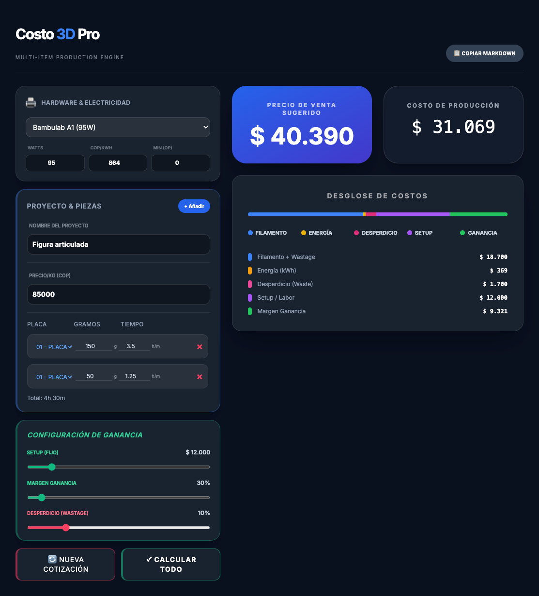

# Costo 3D Pro 🛠️

**Multi-Item Production Engine** - Calculadora profesional de costos para impresión 3D

Una herramienta web moderna y potente para calcular de forma precisa los costos de producción de piezas impresas en 3D, considerando múltiples variables como consumo de energía, desperdicio de filamento, costos de setup y márgenes de ganancia.

---

## 👀 Vista Previa



*Interfaz profesional con cálculo de costos en tiempo real, desglose visual de componentes y generador de cotizaciones en Markdown*

---

## 🚀 Características

✅ **Cálculo Multi-Piezas** - Agrega múltiples piezas en una sola cotización  
✅ **Variables Completas** - Hardware, electricidad, filamento, desperdicio, laborales y márgenes  
✅ **Desglose Visual** - Barra de progreso interactiva mostrando distribución de costos  
✅ **Generador de Markdown** - Exporta cotizaciones formateadas al portapapeles  
✅ **Soporte Múltiples Impresoras** - Configurable para diferentes modelos y potencias  
✅ **Interfaz Moderna** - Diseño dark mode profesional con Tailwind CSS  
✅ **Responsive** - Funciona perfectamente en desktop, tablet y móvil  
✅ **Sin Dependencias Externas** - Vanilla JavaScript puro, cero librerías

## 📋 Tabla de Contenidos

- [Vista Previa](#-vista-previa)
- [Características](#-características)
- [Requisitos](#-requisitos)
- [Instalación](#-instalación)
- [Uso Rápido](#-uso-rápido)
- [Características Principales](#-características-principales)
- [Estructura del Proyecto](#-estructura-del-proyecto)
- [Tecnologías](#-tecnologías)
- [Personalización](#-personalización)
- [Troubleshooting](#-troubleshooting)
- [Licencia](#-licencia)

## 🔧 Requisitos

- Navegador web moderno (Chrome, Firefox, Safari, Edge)
- No requiere instalación de dependencias
- No requiere servidor backend

## 📦 Instalación

### Opción 1: Archivo Local
1. Descarga todos los archivos del proyecto
2. Abre `index.html` en tu navegador web
3. ¡Listo! La aplicación está funcionando

### Opción 2: Servidor Web (Recomendado)

#### 🐍 Con Python (Opción Recomendada)

**Paso 1: Crear entorno virtual**
```bash
# En la carpeta del proyecto
python3 -m venv venv

# Activar entorno (macOS/Linux)
source venv/bin/activate

# Activar entorno (Windows)
venv\Scripts\activate
```

**Paso 2: Ejecutar servidor**
```bash
# Desde la carpeta del proyecto con entorno activado
python -m http.server 8000
```

**Paso 3: Acceder**
Abre en tu navegador: `http://localhost:8000`

**Detener servidor:** Presiona `Ctrl + C` en la terminal

---

## 💻 Uso Rápido

### 1️⃣ Configurar Hardware
- Selecciona tu impresora 3D del dropdown
- Ajusta potencia (Watts) si es necesario  
- Establece el precio de energía (COP/kWh)

### 2️⃣ Ingresar Datos del Proyecto
- Especifica el nombre del proyecto
- Define el precio del filamento por kg
- Ajusta el porcentaje de desperdicio

### 3️⃣ Agregar Piezas
Haz clic en "+ Añadir" para cada pieza e ingresa:
- **Placa**: Identificador de la pieza
- **Gramos**: Peso de filamento utilizado
- **Tiempo**: Duración en formato h.m (ej: 2.45 = 2h 45min)

### 4️⃣ Configurar Ganancia
Ajusta los sliders para tu estrategia de precios:
- **Setup**: Costo fijo por trabajo
- **Margen Ganancia**: Rentabilidad deseada
- **Desperdicio**: Pérdida de material esperada

### 5️⃣ Calcular y Exportar
- Haz clic en "✓ Calcular Todo"
- Visualiza el desglose de costos en tiempo real
- Copia la cotización en Markdown con "📋 Copiar Markdown"
- Genera una nueva cotización con "🔄 Nueva Cotización"

## 🎯 Características Principales

### Cálculo Detallado de Costos

El motor de cálculo considera 5 componentes principales:

| Componente | Fórmula | Descripción |
|-----------|---------|-------------|
| **Filamento** | `Peso (g) × Precio/kg ÷ 1000` | Costo base del material |
| **Desperdicio** | `Filamento × % Desperdicio` | Pérdida esperada durante impresión |
| **Energía** | `(Watts ÷ 1000) × (min ÷ 60) × $/kWh` | Consumo eléctrico de la máquina |
| **Setup** | `Valor Fijo Configurado` | Costo de preparación del trabajo |
| **Ganancia** | `Total Costos × Margen %` | Rentabilidad del proyecto |

### Interfaz Visual Intuitiva

- **Desglose de Costos en Tiempo Real**: Barra de progreso con código de colores mostrando el peso de cada componente
- **Cálculo Multi-Piezas**: Agrega ilimitadas piezas y ve el resumen total automáticamente
- **Visualización del Precio Sugerido**: Calcula automáticamente el precio de venta recomendado
- **Tabla de Piezas Interactiva**: Gestiona fácilmente todas tus piezas con suma total de tiempo

### Exportación de Cotizaciones

Genera reportes en Markdown con:
- ✅ Fecha y hora del cálculo
- ✅ Modelo de impresora utilizado
- ✅ Nombre del proyecto
- ✅ Listado detallado de piezas
- ✅ Resumen de costos por componente
- ✅ Precio total sugerido de venta
- ✅ Márgenes de ganancia aplicados

**Úsalo para**: Emails de cotización, propuestas, facturación, registro de proyectos

### Configuración Flexible

- **Múltiples Impresoras**: Preconfiguradas (Bambulab A1, P2S) con opción de valores personalizados
- **Precio de Energía Variable**: Adapta el COP/kWh a tu región
- **Márgenes Dinámicos**: Ajusta setup, ganancia y desperdicio por proyecto
- **Interfaz Responsive**: Funciona en desktop, tablet y dispositivos móviles

## 📁 Estructura del Proyecto

```
costo3d-pro/
├── index.html          # Estructura HTML principal
├── css/
│   └── styles.css      # Estilos personalizados
├── js/
│   └── main.js         # Lógica JavaScript
├── favicon.svg         # Icono de la aplicación
└── README.md           # Este archivo
```

## 🛠️ Tecnologías

- **HTML5** - Estructura semántica
- **CSS3** - Estilos y animaciones
- **JavaScript (Vanilla)** - Lógica y cálculos
- **Tailwind CSS** - Framework de utilidades
- **Google Fonts** - Tipografía Inter

## 🎨 Personalización

### Cambiar Valores por Defecto

Edita `js/main.js` para ajustar los valores iniciales:

```javascript
// Configuración de Hardware
<input type="number" id="wattsInput" value="95">      // Potencia (Watts)
<input type="number" id="kwhPrice" value="864">      // Precio (COP/kWh)

// Configuración de Proyecto
<input type="number" id="priceSpool" value="85000">  // Precio filamento/kg

// Configuración de Ganancia
<input type="range" id="laborRange" value="12000">   // Setup (COP)
<input type="range" id="marginRange" value="30">     // Margen (%)
```

### Agregar Nuevas Impresoras

En `index.html`, dentro del `<select id="printerModel">`:
```html
<option value="150">Mi Impresora (150W)</option>
```

## 🐛 Troubleshooting

| Problema | Solución |
|----------|----------|
| **Los precios no se actualizan** | Verifica que todos los campos estén completos y haz clic en "Calcular Todo" |
| **El Markdown no se copia** | Intenta nuevamente o verifica los permisos del navegador para clipboard |
| **Los sliders no responden** | Recarga la página o limpia el caché del navegador |
| **Impresora no aparece** | Agrega manualmente en `index.html` o usa valores custom en Watts |
| **Los valores se pierden al recargar** | Comportamiento normal - no hay persistencia en localStorage |

### Navegadores Soportados

✅ Chrome 90+  
✅ Firefox 88+  
✅ Safari 14+  
✅ Edge 90+

---

## 📄 Licencia

Este proyecto está disponible de forma libre para uso personal y comercial.

---

## 🤝 Contribuciones

¿Encontraste un bug o tienes una idea de mejora? Las contribuciones son bienvenidas.

Por favor documenta:
- 🐛 Navegador y versión
- 📝 Pasos para reproducir el problema
- ✅ Resultado esperado vs resultado actual

---

<div align="center">

**Desarrollado con ❤️ para profesionales de impresión 3D**

*Simplifica tus cálculos de costos. Aumenta tu rentabilidad.*

v1.0.0 — 2026

</div>
